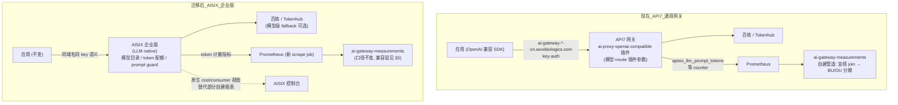

# LLM 流量迁移方案:API7 → AISIX 企业版

|  |  |
| --- | --- |
| 文档版本 | v0.4(评审稿) |
| 日期 | 2026-09-14 |
| 作者 | AI 平台团队 |
| 状态 | 待评审 |

## 1. 背景

### 1.1 现状:用通用 API 网关跑 LLM 流量

当前 LLM 流量全部经过 **API7(通用 API 网关)**,LLM 能力是通过 `ai-proxy-openai-compatible` 插件"外挂"实现的:

*   网关域名:`ai-gateway-cn.wuxibiologics.com`(生产)、`ai-gateway-test-cn.wuxibiologics.com`(测试)
    
*   模型转发:插件按 route 配置,把 OpenAI 兼容请求转发到百炼 / Tokenhub
    
*   计量:插件暴露 `apisix_llm_prompt_tokens` / `apisix_llm_completion_tokens` counter → Prometheus → `ai-gateway-measurements` 自建管道
    

**规模(2026-05-30 ~ 09-11,105 天)**:

| 维度 | 数据 |
| --- | --- |
| 总 token | ~1,405 亿;月度 05 月 114M → 08 月 57,575M,持续增长(9 月半月 32,370M) |
| consumer | 245 个(API7 侧),活跃 145 个 |
| 模型 | 24 个(glm-5.x 84,244M / deepseek-v4 24,096M / qwen3.x 29,395M / kimi 5,911M / embedding 1,421M…) |
| 上游协议 | /v1/messages(89,287M)、/v1/chat/completions(53,598M)、/v1/responses(1,506M)、/v1/embeddings(1,421M) |
| 上游厂商 | 百炼、Tokenhub(vendor 归属目前靠 PM 手工维护 CSV 分摊) |

### 1.2 痛点:通用网关对 LLM 不友好

这些是运行这套体系半年来实际踩到的,不是理论问题:

| # | 痛点 | 现状的代价 |
| --- | --- | --- |
| P1 | **模型不是一等公民**:每上一个模型都要改 route 插件配置(model、上游、覆盖路径),无模型目录 | 9 月新模型(glm-5.3 等)上线靠手工配置;`model_vendor_allocation.csv` 靠 PM 手工维护厂商归属,新模型漏配就全落默认 |
| P2 | **无 token 级限流/配额**:只有通用请求级限流,做不到"某 consumer 每月 1 亿 token" | 35% 用量来自未备案 consumer(493 亿),靠事后审计(api7\_audit)追,无法事前拦 |
| P3 | **consumer 与项目/Owner 脱钩**:consumer 只是 key 名,desc 里邮箱格式不统一 | 85 个 consumer 无法对到宜搭备案;需要自建 api7\_audit 模糊匹配 + 人工分配表兜底 |
| P4 | **LLM 可观测性缺失**:无原生 cost/token 视图,指标要自己写 PromQL + 自建管道 | BU/OU 月度报表 = 本 repo 全套管道(Step1/Step2/adjust)人工跑;无实时视图 |
| P5 | **无 prompt 治理与内容安全**:通用网关不感知请求体 | 无敏感信息防护、无 prompt 日志留存(合规要求越来越明确) |
| P6 | **多厂商 failover/重试策略弱**:上游故障切换要靠 route 配置 | 单厂商故障即业务故障 |

### 1.3 为什么是 AISIX

AISIX 是 API7 同厂商(API7.ai / 支流科技,Apache APISIX 背后公司)推出的 **LLM native 网关**,企业版交付。选择它而不是其他 AI 网关(或继续用 API7 硬扛)的理由:

1.  **产品定位就是解决 P1~P6**:模型目录/多厂商路由、token 级限流与配额、consumer 级成本归集、prompt 治理、LLM 可观测性开箱即用。
    
2.  **同厂商,兼容底座**:同样基于 APISIX 生态,数据面行为(key-auth、OpenAI 兼容转发、Prometheus 指标)延续性最好,迁移风险低于换厂商。
    
3.  **数据面协议不变**:业务方仍然走 OpenAI 兼容接口,**域名、路径、API key 语义全部不变,业务方零改动**。
    
4.  与现有自建管道(`ai-gateway-measurements`)的计量指标体系同源,报表口径可平滑衔接(详见 §4.2 与 §5 前置测试)。
    

### 1.4 目标与非目标

**目标**:

*   \[G1\] 全量 LLM 流量(4 类 URI、24 模型、245 consumer)切到 AISIX 企业版,业务方零代码改动。
    
*   \[G2\] 计量与报表连续:切换日前后 token 统计无断层、无重复;BU/OU 月度报表口径不变。
    
*   \[G3\] 灰度可控、可回退:LB 权重阶梯切流(prod-cn 金丝雀先行,test-cn 10%→50%→100%),任一档秒级拨回。
    
*   \[G4\] 迁移后逐步用 AISIX 原生能力替代自建补丁(P2/P3 的审计和人工分配表,见 §8)。
    

**非目标**:

*   不改对外 API 协议(仍 OpenAI 兼容)。
    
*   不在本项目内做 consumer 治理(改名/补备案),那是治理线(ROADMAP 阶段三),与切流解耦。
    
*   不变更下游厂商合同(百炼/Tokenhub 照旧,AISIX 上游重新配 key 即可)。
    

## 2. 现状痛点 → AISIX 能力映射

| 痛点 | AISIX LLM native 能力(待与厂商逐项确认,见 §9 清单) | 迁移后的形态 |
| --- | --- | --- |
| P1 模型非一等公民 | 模型目录 / 多厂商模型注册;模型上线 = 配置一个模型条目,不动 route | PM 自维护的 `model_vendor_allocation.csv` 大部分场景由模型目录元数据替代 |
| P2 无 token 限额 | consumer 级 token 配额/限流(按 prompt+completion 计量) | 未备案 consumer 可配低配额,把"事后审计"变"事前拦截" |
| P3 consumer 脱钩 | consumer 元数据(owner、部门、项目编号)、key 全生命周期管理 | 宜搭备案字段与 consumer 元数据对齐;`api7_audit` 从模糊匹配升级为直接对账 |
| P4 可观测缺失 | 原生 token/cost 视图、按 consumer/模型维度报表 | 实时看板用 AISIX 自带;月度 BU/OU 分摊报表仍走本管道(业务口径在宜搭+CSV) |
| P5 无 prompt 治理 | prompt guard(敏感词/注入防护)、请求日志留存策略 | 合规要求落地,按需开启 |
| P6 failover 弱 | 多厂商同模型 fallback、按权重分流 | 同模型多出口(如 glm 走双厂商)成为配置项 |

> 注:AISIX 能力映射以 dev 集群实测为准,§9 列了验证清单。上表是迁移论证,未核实项在阶段 2 逐条验证。

## 3. 目标架构



部署要点:

| 项 | 方案 |
| --- | --- |
| 形态 | AISIX 企业版。**dev 集群仅用于当前测试验证,最终生产数据节点将部署在 ops 集群**(与现 API7 同集群),见下方"集群路径" |
| 容量 | 3 节点起步;当前峰值日 token ~2,000M、QPS 以对话补全为主,数据面资源需求与现 API7 相当 |
| 域名 | **沿用** `ai-gateway-cn` / `ai-gateway-test-cn`;LB 后端切换,DNS TTL 提前降到 60s |
| 上游 key | 新申请厂商 API key(AISIX 侧重配),旧 key 留在 API7 至退订,便于回退 |
| 旧网关 | 切换期保持热备(ops 集群,LB 可拨回);稳定 2 周后下线订阅 |

**集群路径(重要)**:

```text
阶段          数据节点位置     说明
─────────────────────────────────────────────────────────────
当前(验证)    dev 集群       AISIX 已部署,§5 前置测试、§9 能力验证
                            全部在 dev 集群完成,不碰生产流量
生产上线      ops 集群       验证通过后,在 ops 集群部署生产 AISIX 集群,
                            dev 集群配置导出→导入,再按 §6 灰度切流

```

*   dev 集群承载的是**测试验证**,不承载生产流量;§6 阶段 4 的灰度切流是切到 **ops 集群的生产 AISIX**(阶段 3 部署),不是 dev。
    
*   dev 集群 AISIX 验证完成后保留,作为后续变更(模型上线、规则调整)的预验证环境。
    
*   由此,灰度不涉及跨集群生产流量;跨集群的复杂度收敛为一次性动作:dev 配置导出 → ops 集群导入。
    

## 4. 迁移清单

### 4.1 配置迁移(API7 → AISIX)——重构而非平移

AISIX 的模型/消费者是一等对象,迁移是**重新建模**,不是 1:1 复制 route:

| API7 侧对象 | 数量 | → AISIX 侧形态 | 迁移方式 |
| --- | --- | --- | --- |
| Route(按 URI×域名) | ~8 | LLM 路由(统一入口 + 模型路由) | 导出后按 AISIX 模型重导;或按模型目录重建 |
| Service(上游组) | 3 | 厂商 Provider(模型目录挂载) | 新建 Provider + 新 key |
| ai-proxy 插件里的 model 参数 | 24 | 模型目录条目(含厂商、fallback) | **从 daily\_token\_fact 的 24 个 llm\_model 清单生成**,逐个配置 |
| Consumer + credential | 245 | Consumer(owner 元数据补全) | Admin API 导出→导入;**借机补 desc 邮箱,但不改名**(改名与切流解耦) |
| key-auth / 限流配置 | \- | AISIX 对应能力(token 配额替代请求限流) | 按 P2 目标重新设计,不照搬 |

#### 4.1.1 Consumer key 平移(已验证可行)

**结论:245 个 consumer 的 API key 可以原样同步到 AISIX,下游不需要换 key。**

已通过 API7 Admin API 实测(2026-09-14):

*   credential 端点:`GET /apisix/admin/consumers/{username}/credentials?gateway_group_id=...`
    
*   245 个 consumer 全部有 credential,**246 个 key 全部唯一**,格式统一为 key-auth
    
*   key 值本身含 `Bearer`  前缀(客户端 `Authorization: Bearer <32hex>`),迁移到 AISIX 时保持同样格式即可
    
*   特例:zhu\_zhibo 有 2 个 credential(`ai-key` 正常 key + `ai-key-old` JWT 格式旧 key),同步时**两个都要带上**(旧 key 可能还有存量客户端在用)
    

迁移脚本 `aisix_import.py` 的 key 同步逻辑:

```text
for each consumer in API7 (245):
    GET /apisix/admin/consumers/{username}/credentials
    for each credential:
        PUT AISIX consumer credential (同名 ai-key, 同 key 值, 同 Bearer 格式)

```

#### 4.1.2 DNS 切换与"下游无缝"边界条件

**域名现状**(已验证):

| 域名 | 当前解析 | 位置 |
| --- | --- | --- |
| `ai-gateway-test-cn.wuxibiologics.com` | 10.247.1.44 | ops 集群(API7 数据面) |
| `ai-gateway-cn.wuxibiologics.com` | 10.247.9.72 | ops 集群(prod 入口) |

**切 DNS 能否无缝,取决于三个条件,缺一个就不是"零改动"**:

| 条件 | 状态 | 说明 |
| --- | --- | --- |
| C1 API key 不变 | ✅ 可满足 | §4.1.1,key 平移 |
| C2 请求路径/协议不变 | ✅ 可满足 | 4 类 URI 原样配到 AISIX 路由 |
| C3 客户端不缓存/不自锁旧地址 | ⚠️ 需评估 | 见下 |

C3 的具体风险点:

1.  **DNS TTL**:切换前一周把两个域名的 TTL 降到 60s;公司内网 DNS(WBI01BIODC02 等)是否有长缓存策略要和基础架构确认。
    
2.  **客户端长连接**:SDK 若用连接池 + keep-alive,TTL 过期后仍复用旧 TCP 连接 → 必须让旧网关在切换窗口保持可服务(回退保险),直到旧连接自然耗尽。计划:旧网关热备 2 周(§6 阶段 5),期间新连接全部去 ops 集群生产 AISIX。
    
3.  **hosts 硬编码**:部分服务可能在本机 hosts/配置文件里写了 IP(而不是域名)。**排查方式**:旧网关访问日志按 UA/IP 聚合,切换前抓一周,对"切换后仍在打旧网关"的来源逐一通知。这也是灰度期"该 consumer 旧网关未归零"的主要归因手段。
    
4.  **证书 SNI/校验**:沿用同域名 → 证书不变,只要 ops 集群生产 AISIX 挂同一张证书(或同 CA 签发),无感。
    

**推荐切换方式**(比直接改 DNS 记录更稳):

*   域名解析不动,**先改 LB 后端**:test-cn 的 LB(现指 ops 集群 API7)按权重加 **ops 集群生产 AISIX** 节点(10%→50%→100%),DNS 完全不参与灰度;
    
*   全量稳定后再改 DNS 指向(或保持 LB 不动,DNS 永久指向 LB)。
    
*   好处:灰度粒度在 LB 权重,秒级可回退,不受 DNS TTL 摆布;回退 = LB 权重拨回,不用等 DNS 生效。
    
*   同集群内切 LB 后端(旧 API7 与新 AISIX 都在 ops 集群),网络路径不变,长连接/hosts 硬编码的暴露面也更小。
    

#### 4.1.3 迁移脚本与执行方式

配置迁移不手工点控制台,全部脚本化并入库 `src/maas_usage_sync/`,可重复、可 diff、可审计:

| 脚本 | 作用 | 输入 → 输出 |
| --- | --- | --- |
| `aisix_export.py` | 从 ops 集群 API7 Admin API 拉全量配置 | → `output/aisix_migration/manifest.json`(consumer 245 + credential 246 + desc 邮箱 + 路由/插件参数) |
| `aisix_model_catalog.py` | 从 daily\_token\_fact 生成模型清单 | → `input/aisix_model_catalog.csv`(24 行:model, provider, fallback) |
| `aisix_import.py` | 按 manifest 写入 AISIX(consumer/key/路由) | manifest → AISIX Admin API;支持 `--dry-run`,幂等(PUT by name,重跑不产生重复对象) |
| `aisix_verify.py` | 迁移后对账 | 双侧计数对比:consumer/credential 数、key 哈希、模型数、路由数;输出 diff CSV |

执行约定:

1.  **key 不落盘**:manifest 在内存/临时文件中转,日志脱敏(只留前 6 位);manifest 用后即删,绝不入 git。
    
2.  **desc 邮箱补全**:import 时把 API7 desc 里的邮箱写入 AISIX consumer 的 owner 元数据(P3 治理的起步动作);缺邮箱的(atlas\_control\_tower、nextgen 等)输出清单走人工补录。
    
3.  **防配置漂移**:dev 验证通过后、ops 导入前,重跑一次 export 并 diff(防止验证期间有人在旧网关改了配置);ops 导入后再跑 verify 确认两侧一致。
    

### 4.2 计量兼容性(本 repo 最关心的)

自建管道依赖以下指标契约,**必须在验证阶段(§6 阶段 2)逐项验证**:

```promql
sum by (matched_host, matched_uri, service, consumer, llm_model) (
  increase(apisix_llm_prompt_tokens[1d])
)

```

| 验证项 | 通过标准 | 不通过时的对策 |
| --- | --- | --- |
| metric 名称 | `apisix_llm_prompt_tokens` / `apisix_llm_completion_tokens` 同名 | 在管道 `transform.py` 加 metric 名映射(改动小,已预留) |
| label 集合 | `consumer, llm_model, matched_host, matched_uri, service` 齐全 | 缺 label → 管道加 label 补齐层;AISIX 若提供等价 label(如 model 而非 llm\_model)做映射 |
| counter 语义 | 重启不清零、per-instance 独立 | 同左 |
| 指标端点 | `/apisix/prometheus/metrics` 可抓 | Prometheus 加对应 exporter 配置 |

**切换期间双跑防重复**:新旧网关各自是独立 counter,Prometheus 用**不同 scrape job**(instance 标签不同),管道按 job/consumer/day 聚合天然求和去重。旧网关流量归零后下线旧 job。

**切换月的月度报表口径**(关键细节,提前定死):

*   切换当月,同一 consumer 的 token 分散在两个网关 → 管道聚合天然合并(见上),月表不需特殊处理。
    
*   但**对账口径**要留痕:切换日之后,在日报之外按月跑一次 `old_job vs new_job` 的 consumer 级拆分表,直到旧 job 下线,证明"合并后总量 = 旧基线外推 ±2%"。
    
*   首次以 AISIX 为数据源的月度账单(切换后第一个完整月)生成后,与 AISIX 原生报表对账一次(§6 阶段 5 第 5 条),作为计量口径的最终验收。
    

### 4.3 报表与治理衔接

*   **月度 BU/OU 报表**:口径全部留在本管道(宜搭备案、共享项目分摊、人工分配表),AISIX 切换不影响业务口径,只影响计量数据源(§4.2 保证连续)。
    
*   **实时/运营视图**:逐步迁到 AISIX 原生 cost/consumer 视图,替代 daily\_token\_overview 的人工转发。
    
*   **治理联动**:consumer 元数据(owner 邮箱)补全后,`api7_audit` 的 not\_in\_yida 对账从"模糊匹配猜笔误"变成"直接按 owner 对账",needs\_attention 治理(ROADMAP M2)效率翻倍。
    

## 5. 迁移前置测试(measurement 管道兼容性验证)

**原则:measurement 管道(**`**ai-gateway-measurements**`**)必须在新网关上产出与旧网关一致的结果,才允许切流。** 以下测试在验证阶段(§6 阶段 2)完成,任何一项不过则整改后重测,不进入灰度。

### 5.1 测试环境与数据集

| 项 | 准备 |
| --- | --- |
| 被测网关 | AISIX 企业版,**数据节点已部署在 dev 集群**;已配置模型目录(24 模型)+ 若干测试 consumer |
| 对照网关 | 现 API7 test-cn(数据节点在 ops 集群),作为基准 |
| 对照数据 | 已有 105 天 daily\_token\_fact 归档(`output/step1_token_project_model/`),作为"旧世界"基准 |
| 测试流量 | 脚本化请求集(见 5.2 T1),入 repo `tests/e2e/`,可重复执行 |
| 管道配置 | 验证期并行抓两个集群网关指标(不同 scrape job),管道可分别对两个数据源跑出结果 |
| 网络前提 | 办公网/应用侧到 dev 集群 AISIX 数据节点的连通性(LB/VIP、egress 到百炼/Tokenhub)预先打通 |

### 5.2 测试用例

#### T1 功能面:请求转发与响应一致性

| # | 用例 | 步骤 | 通过标准 |
| --- | --- | --- | --- |
| T1.1 | 4 类 URI 全通 | 对 `/v1/messages`、`/v1/chat/completions`、`/v1/responses`、`/v1/embeddings` 各发非流式请求 | HTTP 200;响应体结构与旧网关 diff 一致(忽略 id/timestamps) |
| T1.2 | 24 模型逐一回归 | 从 daily\_token\_fact 提取的模型清单(glm-5.1/5.2/5.3、deepseek-v4-pro/flash、qwen3.x 系、kimi-k2.5/2.6、text-embedding-v4 等)逐个发请求 | 全部可用;`llm_model` 与请求参数一致(为 T2 的 label 校验铺垫) |
| T1.3 | 流式 SSE | chat/completions 与 messages 各发流式请求 | chunk 语义一致;首 token 延迟与旧网关差 < 100ms;结束帧含 usage |
| T1.4 | key-auth 行为 | **用从 API7 平移的真实 key**(§4.1.1,含 zhu\_zhibo 的 ai-key-old 旧 JWT key)/ 错误 key / 过期 key | 认证通过/拒绝行为与错误码与旧网关一致;246 个 key 全量在 AISIX 侧可认证 |
| T1.5 | embedding 模型 | text-embedding-v4、qwen3.7-text-embedding | completion\_tokens=0 语义保持(管道按 prompt-only 处理,见 transform.py merge 逻辑) |

#### T2 指标契约:管道数据源兼容性(最关键)

| # | 用例 | 步骤 | 通过标准 |
| --- | --- | --- | --- |
| T2.1 | metric 存在性 | 抓取新网关指标端点,grep 指标名 | `apisix_llm_prompt_tokens`、`apisix_llm_completion_tokens` 存在且为 counter 类型 |
| T2.2 | label 完整性 | 发 N 个已知请求(特定 consumer+model+host+uri),查指标序列 | 5 个业务 label 齐全:`consumer, llm_model, matched_host, matched_uri, service`;值与请求参数完全一致 |
| T2.3 | 空值防护 | 用未注册 consumer / 异常请求探测 | 不产生空 consumer 序列(对照:现网关存在 `missing_consumer` ~150 亿的历史问题,新网关不允许复现) |
| T2.4 | counter 单调性 | 持续发请求 + 重启网关实例 | increase() 不为负;重启不清零(或重启语义已知且管道可处理) |
| T2.5 | 多实例聚合 | 若数据面多副本:同一请求打到不同实例 | 按 label 聚合后 token 无丢失、无重复(管道的 sum by 语义) |
| T2.6 | 评估时间语义 | 在次日 00:00(Asia/Shanghai)执行管道标准 PromQL `increase(metric[1d])` | 与当日实发 token 一致——验证管道的 `evaluation_timestamp_for_day` 时间语义在新数据源上成立 |

#### T3 管道端到端:全流程对账

| # | 用例 | 步骤 | 通过标准 |
| --- | --- | --- | --- |
| T3.1 | Step 1 单日对账 | 用脚本流量集打一天,分别对旧网关、新网关跑 `step1 --date <D>` | 两边 daily\_token\_fact 的行集合与 token 数一致(容差 0,脚本流量 token 量确定) |
| T3.2 | Step 2 全链路 | 对 T3.1 输出跑 step2 + adjust | project\_bu\_allocation、monthly\_bu\_ou\_vendor\_usage 与旧网关口径一致 |
| T3.3 | 历史数据回放 | 用新网关指标端点**伪造/回放**一段历史(或用验证期真实 7 天),管道全流程跑 7 天 | 7 天 daily\_token\_overview 曲线连续,无负值、无断点 |
| T3.4 | 宜搭映射 join | 用真实 consumer(已在宜搭备案,如 top 20)打流量,跑 step1 | mapping\_status=matched;consumer→project→BU/OU 链路与旧网关结果一致 |
| T3.5 | 未备案 consumer | 用未备案 consumer 打流量 | 进 needs\_attention,api7\_audit 对账行为一致 |
| T3.6 | 单元测试回归 | `PYTHONPATH=src python -m unittest discover -s tests` | 65/65 通过(管道代码若为兼容 AISIX 有改动,改动不破坏现有测试) |

#### T4 计量准确性

| # | 用例 | 步骤 | 通过标准 |
| --- | --- | --- | --- |
| T4.1 | token 计数对账 | 发请求集,比对三方:①新网关指标 ②响应体 usage 字段(prompt\_tokens+completion\_tokens) ③厂商控制台账单 | 三方一致,误差 < 1% |
| T4.2 | 与旧网关交叉对账 | 同一请求分别走新旧网关(双活期) | 同一请求两网关计量 token 相同 |
| T4.3 | 采购分摊影响 | 用验证期数据生成 OU/BU 比例,与旧网关同期比例对比 | 比例偏差 < 1pp(不改变费用分摊结论) |

### 5.3 测试结论门槛

| 门槛 | 要求 | 不通过的后果 |
| --- | --- | --- |
| Gate A(进入管道对账) | T1、T2 全过 | 整改后重测;T2 不过的指标契约差异需先完成管道兼容层改造 |
| Gate B(进入生产部署) | T3、T4 全过 | 缺一项则部署延期;T3.1/T4.1 为硬性项,不允许带病切流 |
| 灰度期持续校验 | 每日切换日报(§5.5):新旧网关 consumer 数、token 量、错误率 | 连续 3 天对齐(±2%)才允许提档 |

### 5.4 测试产物(入 repo 归档)

*   `tests/e2e/`:请求脚本集(参数化 consumer/model/URI/流式)
    
*   `tests/e2e/reports/`:每次执行的对账 diff 报告(CSV:旧值/新值/差值)
    
*   验证期的 Prometheus 快照与管道输出(用于切流评审证据)
    

### 5.5 灰度期切换日报模板(阶段 4 每日 09:30)

数据源:Prometheus 新旧两个 scrape job;发迁移群 + 当档涉及 owner:

```csv
date,lb_weight,new_consumers,old_consumers,consumer_diff,
new_tokens_m,old_tokens_m,align_pct,
err5xx_new,err5xx_old,p99_new_ms,p99_old_ms,auth_fail_new,
anomaly_consumers

```

*   `align_pct` = (新网关 + 旧网关)当日 token / 切换前 3 日基线,绿灯区间 \[98%, 102%\]
    
*   `auth_fail_new` 应恒为 0(所有 key 已平移,非 0 即配置缺失,立即归因)
    
*   `anomaly_consumers`:流量突降、错误突增、或"旧网关仍有流量但按权重应已切走"的 consumer
    
*   判定:全绿 → 当日绿灯;连续 3 天绿灯才允许提下一档(§6 阶段 4)
    

## 6. 迁移步骤(验证 → 生产部署 → 灰度切流)

AISIX 数据节点已在 **dev 集群**部署完成(dev 仅用于测试验证,生产最终落在 ops 集群,见 §3 集群路径),商务/采购环节已结束。时间表从**配置与验证**开始,共 6 周。

### 阶段 1:配置迁移(第 1 周,dev 集群)

| 天 | 任务 | 产出/完成标准 |
| --- | --- | --- |
| D1 | 编写并跑通 `aisix_export.py`(§4.1.3),从 ops 集群 API7 拉全量配置 | `output/aisix_migration/manifest.json`;245 consumer / 246 key / 8 route 全量 |
| D2 | `aisix_model_catalog.py` 生成模型清单;dev 集群 AISIX 配置 Provider(百炼/Tokenhub **新 key**),确认 egress 连通 | 24 模型清单;Provider 就绪(新 key 不落盘,进 AISIX 密文) |
| D3 | `aisix_import.py --dry-run` → 正式导入:模型目录、Consumer 245 + key 246(§4.1.1)、路由与鉴权 | AISIX 侧对象数与 manifest 一致;`aisix_verify.py` diff = 0 |
| D4 | 冒烟:4 类 URI × top 5 模型 × 3 个真实 key(含 zhu\_zhibo 双 key)各发一请求 | 全 200;T1.4 抽样通过 |
| D5 | Prometheus 加 dev 集群 AISIX 临时 scrape job;观察一天指标 | T2.1/T2.2 预检:metric 名与 5 label 齐全 |

### 阶段 2:兼容性验证(第 2 周,dev 集群)

执行 §5 前置测试,依次过 Gate:

1.  **T1 功能面 + T2 指标契约** → Gate A(不过则整改重测,指标契约差异先做管道兼容层)。
    
2.  **T3 管道端到端 + T4 计量准确性** → Gate B。
    
3.  输出对账 diff 报告(§5.4),作为生产部署与切流评审输入。
    

Gate 评审会:AI 平台 + 基础架构 + 厂商,当场裁决"进阶段 3 / 整改重测";纪要归档 `output/aisix_migration/gate_review/`。

### 阶段 3:ops 集群生产部署(第 3 周)

| 步骤 | 任务 | 说明 |
| --- | --- | --- |
| 1 | ops 集群部署生产 AISIX(3 节点 + LB 后端注册) | 基础架构执行;资源按 §12-5 容量规划结论 |
| 2 | **防漂移重导出**:重跑 `aisix_export.py` 并与阶段 1 manifest diff | 有差异(验证期旧网关改了配置)则更新 manifest 再导入 |
| 3 | 配置搬迁:manifest 导入 ops 集群(模型目录、Consumer+key、路由、Provider) | `aisix_verify.py` 在 ops 侧再跑一遍,diff = 0 |
| 4 | T1 抽检(每类 URI + top 5 模型 + key-auth 抽样) | 确认 dev/ops 环境差异无影响 |
| 5 | Prometheus 加 ops 集群 AISIX 生产 scrape job | 独立 job 名,instance 标签区分(双跑防重复,§4.2) |
| 6 | 下线 dev 临时 scrape job | dev 转预验证环境后按需重开 |

### 阶段 4:灰度切流(第 4~5 周,ops 集群内切 LB)

**灰度机制**:LB 权重阶梯,按域名分档——低风险域名(prod-cn,0.2M/日)先全量当金丝雀,test-cn 再按权重爬档。灰度与批次按下表:

| 档位 | 动作 | 对象 | 观察期 | 通过标准(全部满足才提档) |
| --- | --- | --- | --- | --- |
| 0 | **prod-cn 全量 100% → AISIX** | prod-cn(日流量 0.2M,天然金丝雀) | 2 天 | 切换日报绿灯;auth\_fail=0 |
| 1 | test-cn 10% → AISIX | 全体 consumer 的 10% 流量 | 2 天 | 日报全绿(§5.5);无 5xx 突增;P99 ±10% |
| 2 | test-cn 50% | 同上 | 2 天 | 同上 + 连续 3 天 token 对齐 ±2% |
| 3 | test-cn 100% | 全量(含 top 20:xu\_dening、jiang\_ke、atlas\_control\_tower 等服务账号) | 3 天 | 同上;top 20 owner 逐个确认无异常 |

操作细则:

*   **回退演练**:档 1 结束后做一次演练——权重临时拨回 100% 旧 API7,观察 10 分钟(指标恢复、无错误),再拨回 10%。确认回退路径真实可用,不等到出事才第一次用。
    
*   **回退** = LB 权重拨回旧 API7,秒级生效,不受 DNS TTL 限制;档 3 之前回退无需通知业务方,档 3 回退需同步 owner 群。
    
*   **回退决策人**:档 0~2 由 AI 平台值班自行决定(日报红灯即回);档 3 需 AI 平台 + 当值 owner 共同确认。回退后当日出归因,问题闭环才重新提档。
    
*   **高危账号陪跑**:档 3 前 1 天,给 top 20 owner 发预告(含"异常时联系方式");atlas\_control\_tower 等无 owner 的服务账号提前认领(§10 风险表)。
    
*   **hosts 硬编码兜底**:每档观察期跑一次"旧网关残留流量按来源 IP 聚合",识别不走 DNS 的客户端,逐一通知(§4.1.2-C3)。
    
*   **切流窗口**:每档切换选工作日 10:00~11:00(流量高峰前、人员在岗),避开周五下午与节假日前。
    

### 阶段 5:全量与收尾(第 6 周起)

1.  test-cn 100% 稳定 3 天(档 3 达标)→ 进入稳定期。
    
2.  ops 集群旧 API7 保持热备 2 周(只读,LB 一键拨回);期间每日仍出切换日报。
    
3.  热备期满 → 稳定期验收(§7)→ 下线旧 scrape job → 退订 API7 → 配置与 105 天历史数据归档。
    
4.  dev 集群 AISIX 保留,转为变更预验证环境(模型上线、规则调整先在 dev 验证)。
    
5.  退订后 1 个月内,每周跑一次管道月表与 AISIX 原生报表对账,确认口径漂移 < 1%。
    

## 7. 验收标准

| 类别 | 标准 |
| --- | --- |
| 功能 | 4 URI × 24 模型全通;流式行为一致;token 计数与厂商响应一致(误差 < 1%) |
| 业务 | 业务方零改动;切换期间无 P2+ 故障 |
| 计量 | 切换日报 consumer 数对齐(±2);日 token 总量连续无断层;`missing_consumer` 占比 < 5% |
| 性能 | P99 ±10%;错误率 ≤ 旧基线 |
| 收尾 | 旧网关连续 7 天流量为 0;API7 退订;配置归档;AISIX 原生报表上线(token 配额、consumer owner 视图) |

## 8. 迁移后的收益兑现(与 ROADMAP 衔接)

| 能力 | 替代的自建补丁 | 时间点 |
| --- | --- | --- |
| token 配额 | api7\_audit 的事后审计 → 事前拦截 | 切换后即生效 |
| consumer owner 元数据 | manual\_consumer\_bu\_ou\_allocation.csv 的 85 条人工兜底 | 数据补全后逐步退役 |
| 模型目录元数据 | model\_vendor\_allocation.csv 的厂商归属维护 | 切换后过渡,报表口径保留在管道 |
| 原生 cost 视图 | daily\_token\_overview 转发 | 按需 |

> 注意:月度 BU/OU 分摊报表(宜搭 join + 共享项目 + OU/BU 比例 + 采购拆分)**不迁**,业务口径继续留在本管道,只把数据源从 API7 指标换成 AISIX 指标。

## 9. AISIX 能力验证清单(dev 集群实测)

数据节点已在 dev 集群,以下清单通过实际配置与流量验证(不再依赖厂商演示):

| # | 验证项 | 关联 |
| --- | --- | --- |
| 1 | 指标契约:metric 名 / label 集 / counter 语义 / 抓取端点(§4.2 全表) | G2 |
| 2 | 24 个模型全部可配,含百炼自定义模型名与 Tokenhub 路由 | P1 |
| 3 | consumer 级 token 配额(月度/日度),超限行为(拒绝 or 放行告警) | P2 |
| 4 | consumer 元数据字段(owner 邮箱、自定义属性)及 Admin API 读写 | P3 |
| 5 | 原生报表:token/cost 按 consumer、模型、时间维度;能否导出 API | P4 |
| 6 | prompt guard:敏感词/注入检测、日志留存与脱敏策略 | P5 |
| 7 | 同模型多厂商 fallback 与权重分流 | P6 |
| 8 | 流式 SSE 兼容(4 类 URI 实测),首 token 延迟 | G1/G3 |
| 9 | Admin API 完整性(consumer/route/model 批量导入导出) | 阶段 1 |

## 10. 风险与预案

| 风险 | 概率 | 影响 | 预案 |
| --- | --- | --- | --- |
| 指标契约不兼容(metric/label 变化) | 中 | 报表断层 | 阶段 2 第一优先验证;管道预留 metric 映射层,改造工作量已评估(1~2 天) |
| 新厂商 key 生效延迟/配额未迁 | 中 | 部分模型 401/429 | 验证阶段(§6 阶段 2)全模型验证;key 权限对齐旧 key 再切 |
| token 配额误配(限太紧) | 中 | 业务被误拦 | 首月配额只告警不拦截;阈值参考现有月度用量 |
| 高用量服务账号切换失败 | 中 | 业务中断 | top 20 提前 1 天预告 + owner 陪跑;无 owner 服务账号提前认领;LB 一键回退 |
| AISIX 企业版成熟度(新版本缺陷) | 中 | 稳定性 | dev 集群验证期压测;ops 集群灰度分批;旧 API7 热备 2 周;厂商 SLA 条款 |
| 双跑期间重复计数 | 低 | 报表虚高 | per-instance counter + 聚合天然去重;切换日报抽查 |
| 退订后发现需回切 | 低 | 无回退路径 | 退订前导出全量配置;退订放在稳定 2 周后 |

## 11. 分工与时间表

| 角色 | 职责 |
| --- | --- |
| AI 平台(我们) | 方案、验证测试执行、迁移脚本、灰度切流、计量核对、报表衔接 |
| 基础架构 | dev 集群 AISIX 运维(验证环境)、**ops 集群生产 AISIX 部署与运维**(阶段 3)、LB/DNS/证书 |
| 各 consumer owner | top 20 灰度档位预告确认、异常反馈 |

```text
阶段                    周次       内容
─────────────────────────────────────────────────────────────
阶段 1 配置迁移(dev)     第 1 周     D1 export → D2 Provider/模型清单
                                  → D3 import+verify → D4 冒烟
                                  → D5 验证抓取(临时 scrape job)
阶段 2 兼容性验证(dev)   第 2 周     T1/T2 功能+指标契约(Gate A);
                                  T3/T4 管道对账+计量(Gate B);
                                  Gate 评审会裁决是否进阶段 3
阶段 3 生产部署(ops)     第 3 周     ops 集群生产 AISIX 部署;
                                  防漂移重导出 + 配置导入 + T1 抽检
                                  + 生产抓取 + 下线 dev 临时抓取
阶段 4 灰度(ops 集群内)  第 4~5 周   档0 prod-cn 金丝雀 → 档1 10%
                                  → 档2 50% → 档3 100%(top20 陪跑)
阶段 5 收尾              第 6 周起   稳定 3 天 → 旧网关热备 2 周
                                  → 验收 → 退订 + 归档 + 退订后对账

```

## 12. 开放问题(评审决策)

1.  **指标契约不过怎么办**:接受管道改造(1~2 天)还是要求厂商适配?建议先看差异大小再定。
    
2.  **prompt guard 开关范围**:全量开启还是先日志模式(只记录不拦截)观察一个月?合规要求需要明确。
    
3.  **token 配额初值**:按历史月度用量上浮多少?首月"只告警不拦截"是否可接受?
    
4.  **prod-cn 作为档 0 金丝雀**:目前流量仅 0.2M,建议第一个全量切(风险最小、环境最真实),代替"与 test 同窗口"——评审确认。
    
5.  **ops 集群生产 AISIX 的容量规划**:生产节点规格/数量(3 节点起步)是否撑得住峰值(日 2,000M token、对话补全为主的 QPS),与现有 API7 数据面资源对齐,不足则在阶段 3 部署前扩容——**dev 集群不承载生产流量,无需按峰值扩容**。
    
6.  **验证期跨集群抓取链路**:Prometheus(ops 集群)临时抓 dev 集群 AISIX 的网络路径(仅验证期用;生产抓取在 ops 集群内同 Prometheus,无跨集群问题),是临时打通还是 dev 侧本地采集后导出?
    
7.  **切换机制选型**:LB 权重灰度(§4.1.2 推荐,需基础架构配合)vs 直接改 DNS(简单但受 TTL/长连接摆布)——评审定夺。
    
8.  **hosts 硬编码排查**:切换前一周对旧网关访问日志按来源 IP 聚合,识别不走 DNS 的客户端清单。