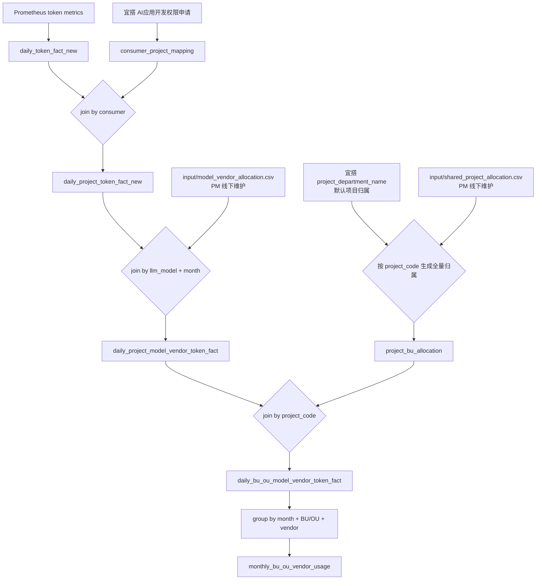

# MaaS Usage Sync

这套脚本用于把 MaaS / APISIX 的 LLM token 使用量，整理成 PM、业务方和仪表盘都能消费的 CSV 表。

核心目标有两个：

- 看清楚 token 用到了哪些项目、哪些模型、哪些 consumer。
- 最终回答 PM 关心的问题：每个月，每个 BU/OU 在各模型厂商上的 token usage 和占比是多少。

最终主表是：

```text
output/final/monthly_bu_ou_vendor_usage.csv
```

粒度是：

```text
month + BU/OU + vendor
```

## 一句话流程

先把 Prometheus 的 token 指标和宜搭项目申请表 join，得到 `token - project - llm_model`；再用 PM 维护的共享项目分账表和 model-vendor 分摊表，把 token 拆到 `BU/OU + vendor`，最后按月聚合。



## 两个步骤

### Step 1: Token - Project - LLM Model

Step 1 解决的问题是：每一天、每个 consumer、每个模型消耗了多少 token，以及这个 consumer 对应哪个项目。

输入：

- Prometheus token 指标。
- 宜搭表单：`AI应用开发权限申请`。

主要处理：

- 从 Prometheus 拉取 input token 和 output token。
- 按天、consumer、llm_model、gateway、service、URI 聚合。
- 从宜搭 approved 流程中解析 consumer 和项目关系。
- 用 `consumer` 把 token 明细 join 到项目。

主要输出：

```text
output/step1_token_project_model/consumer_project_mapping.csv
output/step1_token_project_model/daily_token_fact_new.csv
output/step1_token_project_model/daily_token_overview_new.csv
output/step1_token_project_model/daily_project_token_fact_new.csv
```

### Step 2: Token - BU/OU - Vendor

Step 2 解决的问题是：项目 token 应该归属到哪个 BU/OU，模型 token 应该归属到哪个模型厂商。

输入：

- Step 1 输出的 `daily_project_token_fact_new.csv`。
- PM 维护的 `input/shared_project_allocation.csv`。
- PM 维护的 `input/model_vendor_allocation.csv`。

主要处理：

- 先生成全量 `project_code -> BU/OU -> ratio` 分摊表。
- 再根据 `llm_model + month` 找模型厂商分摊比例。
- token 先按 vendor ratio 拆，再按 BU/OU ratio 拆。
- 最终按 `month + BU/OU + vendor` 聚合。

主要输出：

```text
output/step2_bu_vendor/project_bu_allocation.csv
output/step2_bu_vendor/daily_project_model_vendor_token_fact.csv
output/step2_bu_vendor/daily_bu_ou_model_vendor_token_fact.csv
output/step2_bu_vendor/bu_ou_usage_attention.csv
output/final/monthly_bu_ou_vendor_usage.csv
```

## PM 需要维护的输入表

### 共享项目分账表

文件：

```text
input/shared_project_allocation.csv
```

字段：

```text
project_code,BU/OU,ratio
```

含义：

- 如果一个项目是共享项目，PM 在这里维护它真正的使用 BU/OU 和比例。
- `ratio` 用百分数，例如 `60` 表示 60%。
- 同一个 `project_code` 可以有多行，表示拆给多个 BU/OU。

覆盖规则：

- 如果 `project_code` 出现在共享项目分账表里，使用共享项目分账表的 BU/OU + ratio。
- 如果没有出现，使用宜搭项目归属部门作为默认 BU/OU，比例为 100%。

### Model - Vendor 分摊表

文件：

```text
input/model_vendor_allocation.csv
```

字段：

```text
llm_model,month,vendor,ratio,match_type
```

示例：

```text
deepseek-v4-pro,2026-07,Bailian,30,exact
deepseek-v4-pro,2026-07,Tokenhub,70,exact
qwen*,,Bailian,100,prefix
text-embedding-v4,,Bailian,100,exact
*,,Tokenhub,100,default
```

含义：

- `exact + month`：某个模型在某个月有特殊厂商分摊。
- `exact + 空 month`：某个模型的长期默认厂商。
- `prefix + 空 month`：某类模型的默认厂商，例如 `qwen*`。
- `default + 空 month`：所有未命中规则的兜底厂商。

匹配优先级：

```text
1. exact + month
2. exact + 空 month
3. prefix + 空 month
4. default + 空 month
```

月份会被标准化：`2026.06`、`2026/06`、`2026-6` 都会当成 `2026-06`。

一个关键点：如果模型只配置了某个月的特殊比例，其他月份不会沿用这个特殊比例，而是继续走默认规则。例如 `deepseek-v4-pro` 只配置了 `2026-07` 的 30/70，计算 `2026-08` 时会落到默认规则。

## 关键输出表

### daily_token_fact_new

路径：

```text
output/step1_token_project_model/daily_token_fact_new.csv
```

用途：基础 token 明细。适合做 consumer 排行、model 排行、gateway/env 过滤。

粒度：

```text
date + gateway_env + gateway_host + matched_uri + service + consumer + llm_model
```

关键字段：

```text
date,month,consumer,llm_model,prompt_tokens,completion_tokens,total_tokens
```

### daily_project_token_fact_new

路径：

```text
output/step1_token_project_model/daily_project_token_fact_new.csv
```

用途：给 token 补上 project 信息，是 Step 2 的基础输入。

关键字段：

```text
date,month,consumer,llm_model,mapping_status,project_code,project_name,project_department_name,prompt_tokens,completion_tokens,total_tokens
```

`mapping_status`：

- `matched`：consumer 匹配到唯一项目。
- `unmatched`：consumer 没有匹配到项目。
- `multi_project_first`：consumer 对应多个项目，当前临时使用第一个项目归属，同时保留 `matched_project_count` 供排查。

### project_bu_allocation

路径：

```text
output/step2_bu_vendor/project_bu_allocation.csv
```

用途：全量 project 到 BU/OU 的分摊表。

字段：

```text
project_code,project_name,BU/OU,bu_ratio,allocation_source
```

`allocation_source`：

- `yida_default`：来自宜搭默认项目归属，比例 100%。
- `shared_project`：来自 PM 维护的共享项目分账表，覆盖宜搭默认归属。

宜搭默认项目归属会从 `project_department_name` 提取 N-1 BU/OU：取第一个 `-` 后的第一段。

例子：

```text
药明生物 WuXi Biologics-全球生物药研发业务部-生物药研发技术中心-数据科学部
```

会转换成：

```text
全球生物药研发业务部
```

如果部门格式不符合预期，例如只有 `Project Team`，会标为 `needs_attention`，并写入 attention 表。

### daily_project_model_vendor_token_fact

路径：

```text
output/step2_bu_vendor/daily_project_model_vendor_token_fact.csv
```

用途：把 project token 先按 model-vendor ratio 拆到厂商。

关键字段：

```text
date,month,project_code,llm_model,vendor,vendor_ratio_applied,input_tokens,output_tokens,total_tokens
```

计算：

```text
input_tokens = prompt_tokens * vendor_ratio / 100
output_tokens = completion_tokens * vendor_ratio / 100
total_tokens = total_tokens * vendor_ratio / 100
```

这里的 `vendor_ratio_applied` 是追溯字段：token 已经按这个比例拆完了，但保留它方便解释为什么这行 token 是这个值。

### daily_bu_ou_model_vendor_token_fact

路径：

```text
output/step2_bu_vendor/daily_bu_ou_model_vendor_token_fact.csv
```

用途：每日级别的 BU/OU + model + vendor 明细，主要用于排查和追溯。

关键字段：

```text
date,month,project_code,BU/OU,bu_ratio_applied,llm_model,vendor,vendor_ratio_applied,input_tokens,output_tokens,total_tokens
```

计算：

```text
input_tokens = vendor_input_tokens * bu_ratio / 100
output_tokens = vendor_output_tokens * bu_ratio / 100
total_tokens = vendor_total_tokens * bu_ratio / 100
```

### monthly_bu_ou_vendor_usage

路径：

```text
output/final/monthly_bu_ou_vendor_usage.csv
```

用途：PM 最终消费表。

字段：

```text
month,BU/OU,vendor,input_tokens,output_tokens,total_tokens,input_tokens_millions,output_tokens_millions,total_tokens_millions,percent
```

`percent` 计算口径：

```text
当前 month + BU/OU + vendor 的 total_tokens / 当前 month 的全部 total_tokens * 100
```

也就是说，同一个月内所有 `BU/OU + vendor` 的 `percent` 理论上加总约等于 100，可能因为四舍五入存在极小尾差。当前保留 2 位小数。

## Attention 表

路径：

```text
output/step2_bu_vendor/bu_ou_usage_attention.csv
```

用途：把需要人工关注的数据质量问题单独输出，不阻断主流程。

当前会输出这些问题：

- 宜搭 `project_department_name` 格式非预期，无法提取 N-1 BU/OU。
- 同一个 `project_code` 的 BU/OU ratio 加总不等于 100。
- 同一个 `llm_model + month + match_type` 的 vendor ratio 加总不等于 100。
- 找不到 project allocation。
- 找不到 model vendor allocation。

默认兜底：

- 找不到 project allocation：`BU/OU=needs_attention`，`bu_ratio_applied=100`。
- 找不到 model vendor allocation：`vendor=needs_attention`，`vendor_ratio_applied=100`。
- 宜搭部门格式非预期：`BU/OU=needs_attention`，同时记录原始部门值。

## 怎么跑

准备配置：

```bash
cp config.example.json config.local.json
```

然后在 `config.local.json` 中补充本地密钥和配置。真实 token / secret 不要提交到代码仓库。

跑 Step 1，默认同步昨天一天：

```bash
PYTHONPATH=src python3 -m maas_usage_sync.usage_pipeline step1
```

跑 Step 1 指定日期：

```bash
PYTHONPATH=src python3 -m maas_usage_sync.usage_pipeline step1 --date 2026-07-06
```

跑 Step 1 指定日期范围：

```bash
PYTHONPATH=src python3 -m maas_usage_sync.usage_pipeline step1 \
  --start-date 2026-07-01 \
  --end-date 2026-07-31
```

跑 Step 2：

```bash
PYTHONPATH=src python3 -m maas_usage_sync.usage_pipeline step2
```

Step 1 默认会重新拉 Prometheus 和宜搭，并打开 debug 日志。如果要复用已有宜搭 mapping，可以显式传：

```bash
PYTHONPATH=src python3 -m maas_usage_sync.usage_pipeline step1 \
  --consumer-project-mapping-csv output/step1_token_project_model/consumer_project_mapping.csv
```

Step 2 也支持显式指定输入：

```bash
PYTHONPATH=src python3 -m maas_usage_sync.usage_pipeline step2 \
  --daily-project-token-fact-csv output/step1_token_project_model/daily_project_token_fact_new.csv \
  --model-vendor-allocation-csv input/model_vendor_allocation.csv \
  --shared-project-allocation-csv input/shared_project_allocation.csv \
  --output-dir output
```

## 数据源配置

### Prometheus

配置在 `config.local.json` 顶层：

```json
{
  "prom_base": "https://promethues-ops-cn.wuxibiologics.com/api/v1",
  "prom_token": "...",
  "timezone": "Asia/Shanghai"
}
```

也支持环境变量：

```bash
export PROM_BASE='https://promethues-ops-cn.wuxibiologics.com/api/v1'
export PROM_TOKEN='...'
export MAAS_TIMEZONE='Asia/Shanghai'
```

当前指标口径：

- `apisix_llm_prompt_tokens` 作为 input / prompt token。
- `apisix_llm_completion_tokens` 作为 output / completion token。
- `total_tokens = prompt_tokens + completion_tokens`。

### 宜搭

配置在 `config.local.json` 的 `yida`：

```json
{
  "yida": {
    "enabled": true,
    "app_type": "APP_xxx",
    "form_uuid": "FORM-xxx",
    "system_token": "...",
    "user_id": "...",
    "language": "zh_CN",
    "use_alias": true,
    "search_field_json": "{\"selectField_mov119ub\":\"获取API高代码开发\"}",
    "page_size": 100
  }
}
```

当前宜搭读取链路：

```text
DingTalk app_key/app_secret -> accessToken -> 获取流程实例 -> 解析流程实例 data -> 生成 consumer_project_mapping
```

使用接口：

```text
POST https://api.dingtalk.com/v2.0/yida/processes/instances?pageNumber=1&pageSize=100
```

关键过滤：

- 固定传入 `approvedResult=agree`，只拉审批同意的流程。
- `search_field_json` 当前用于筛选开发方式，例如 `获取API高代码开发`。

主要字段来源：

- `data.textareaField_moxxwwai`：提供用户清单，一行一个邮箱，会转换成个人 consumer。
- `data.textareaField_moxxwwal`：项目 id 清单，直接作为项目类 consumer。
- `data.textField_mov119tc`：项目编号。
- `data.textField_mov119tq`：项目名称。
- `data.departmentSelectField_mov119tb`：项目归属部门。
- `data.employeeField_mov119t8`：申请人。
- `data.departmentSelectField_mov119t9`：申请人部门。
- `data.employeeField_mov119ta`：项目负责人。

邮箱 consumer 转换示例：

```text
qian.wei@wuxibiologics.com -> qian_wei
```

## API7 Consumer 审计

API7 审计解决的问题是：API7 Gateway 里存在的 consumer，哪些没有走宜搭流程备案。

配置在 `config.local.json` 的 `api7`：

```json
{
  "api7": {
    "admin_base": "https://wuxibiologics.admin.api7.cloud",
    "admin_key": "...",
    "gateway_group_id": "...",
    "page_size": 500
  }
}
```

数据源：

```text
GET /apisix/admin/consumers
```

请求会带：

```text
X-API-KEY
gateway_group_id
```

运行：

```bash
PYTHONPATH=src python3 -m maas_usage_sync.api7_audit
```

默认读取：

```text
config.local.json
output/step1_token_project_model/consumer_project_mapping.csv
output/step1_token_project_model/daily_token_fact_new.csv
```

输出：

```text
output/api7_consumers.csv
output/yida_consumers.csv
output/api7_consumers_not_in_yida.csv
```

比对口径：

- API7 侧使用 `list[].username`，写入 `api7_username`。
- 宜搭侧使用 `consumer_project_mapping.csv` 中的 `consumer`。
- 两边都会生成 `normalized_consumer = strip + lower`，避免大小写影响 diff。
- `api7_consumers_not_in_yida.csv` 会保留邮箱列，方便后续邮件触达。
- token 用量来自 `daily_token_fact_new.csv`，用于给未备案 consumer 排优先级。

优先级字段：

- `active_usage_high_priority`：有实际 token 用量，建议优先推动补充宜搭流程。
- `no_token_usage_defer`：当前没有 token 用量，可以后置排查。

如果已经保存过 API7 原始返回，可以离线重算：

```bash
PYTHONPATH=src python3 -m maas_usage_sync.api7_audit \
  --api7-consumers-json output/api7_consumers.json
```

## API7 Consumer 邮件测试

如果要基于 `api7_consumers_not_in_yida.csv` 给缺失备案的 consumer owner 发邮件，先配置 SMTP：

```json
{
  "email": {
    "smtp_host": "smtp.example.com",
    "smtp_port": 587,
    "username": "mailer@example.com",
    "password": "...",
    "from_addr": "mailer@example.com",
    "use_tls": true
  }
}
```

先 dry-run 预览，不会真的发送：

```bash
PYTHONPATH=src python3 -m maas_usage_sync.api7_notify \
  --test-recipient your.name@wuxibiologics.com \
  --limit 3
```

发给自己测试链路：

```bash
PYTHONPATH=src python3 -m maas_usage_sync.api7_notify \
  --test-recipient your.name@wuxibiologics.com \
  --limit 1 \
  --send
```

确认后发给表里的真实邮箱：

```bash
PYTHONPATH=src python3 -m maas_usage_sync.api7_notify \
  --send \
  --send-to-actual
```

默认只选择 `has_token_usage=yes` 且 `api7_email` 不为空的行。`--test-recipient` 会把所有邮件改发到测试邮箱，正文里保留原始收件人，方便确认真实发送对象。

## 同步到钉钉

追加写入钉钉 AI 表格：

```bash
PYTHONPATH=src python3 -m maas_usage_sync.cli --date 2026-07-06 --sync-dingtalk
```

删除钉钉里某个月的数据：

```bash
PYTHONPATH=src python3 -m maas_usage_sync.cli --delete-dingtalk-month 2026-07
```

重刷某个月的数据：

```bash
PYTHONPATH=src python3 -m maas_usage_sync.cli --replace-dingtalk-month 2026-07
```

注意：`--sync-dingtalk` 是追加写入。如果同一天数据已经存在，再执行会产生重复数据。重刷月份时建议用 `--replace-dingtalk-month`。

## 钉钉排障

- 如果返回 `invalidRequest.resource.notFound`，不一定是表不存在，也可能是 AI 表格高级权限里该数据表没有给当前角色数据权限。
- 如果写入中途失败，前面的批次可能已经写入成功。重新 append 前，建议先按月份删除旧数据，避免重复。
- 临时的 `429` / `5xx` 错误会自动重试。
- 新建或复制的数据表，需要确认高级权限里对当前角色开放了完整数据权限。
- 尽量在配置里使用数据表 ID，而不是显示名称，避免重名或改名导致写入异常。

## 推荐图表

当前 DingTalk 仪表盘建议优先放这些图：

- LLM Total Tokens 累计趋势：基于 `daily_token_overview_new.csv`。
- 每月新增 Token 构成：基于 `daily_token_fact_new.csv`，按 `month` 聚合。
- 模型月度 Token 消耗排行：基于 `daily_token_fact_new.csv`，按 `llm_model` 聚合。
- Consumer 月度 Token 消耗 Top 10：基于 `daily_token_fact_new.csv`，按 `consumer` 聚合。
- Project Token 消耗排行：基于 `daily_project_token_fact_new.csv`，按 `project_code` 或 `project_name` 聚合。
- BU/OU Vendor Usage：基于 `monthly_bu_ou_vendor_usage.csv`。
- Attention 排查表：基于 `bu_ou_usage_attention.csv`。

## 本地测试

运行单元测试：

```bash
PYTHONPATH=src python3 -m unittest discover -s tests
```

查看 Step 1 参数：

```bash
PYTHONPATH=src python3 -m maas_usage_sync.usage_pipeline step1 --help
```

查看 Step 2 参数：

```bash
PYTHONPATH=src python3 -m maas_usage_sync.usage_pipeline step2 --help
```
