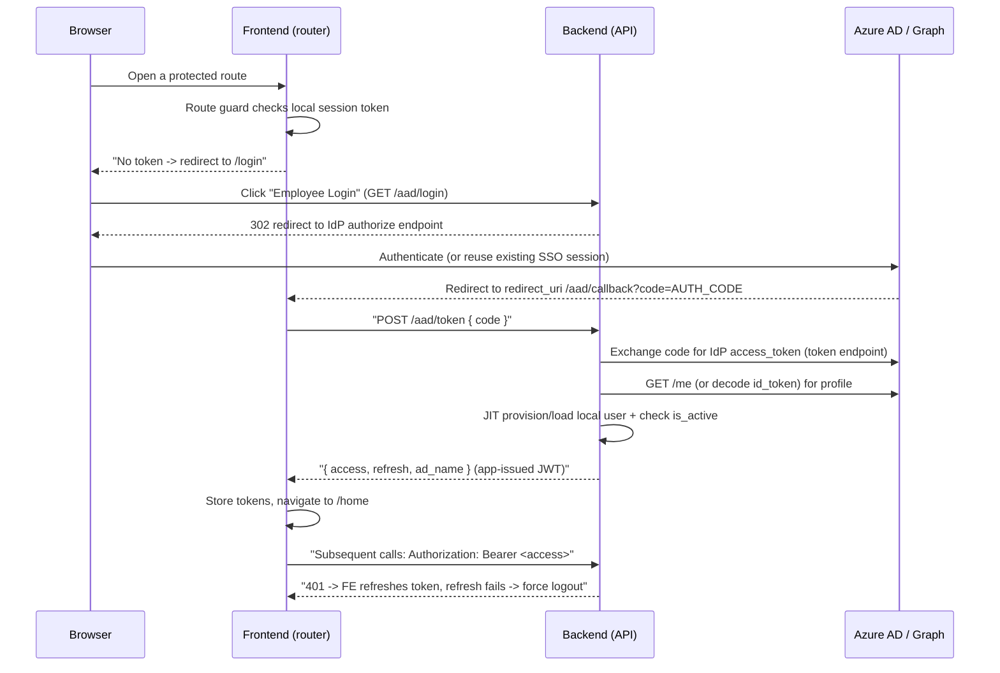

# Add AD (Azure AD / Entra ID) SSO

This skill captures the canonical pattern for adding Active Directory single sign-on, written so it
can be reproduced in any language or framework. It is **language agnostic**: the contract (the HTTP
steps + configuration) is described first, then Python and TypeScript demos make it concrete.

Whatever the stack, the flow always has the same moving parts. Map these onto your own project layout:
- A backend **login** endpoint that 302-redirects the browser to the IdP authorize URL.
- A frontend **callback** route that receives `?code` and forwards it to the backend.
- A backend **token-exchange** endpoint (the only place that holds `CLIENT_SECRET`) that swaps the
  code for an IdP token, resolves the user profile, JIT-provisions a local user, and issues the
  app's **own** session JWT.
- A frontend **token store + HTTP client** that persists the JWT, attaches `Authorization: Bearer`,
  refreshes once on `401`, and force-logs-out when refresh fails.
- A frontend **route guard** that redirects unauthenticated users to the login page.
- (Separate concern) a backend **Graph client** using `client_credentials` for directory sync — this
  is **not** part of the login flow.

## When to use this skill

- Adding AD / Azure AD / Entra ID login to a new or existing app.
- Implementing an `/aad/login` redirect, an `/aad/callback` handler, or a `code`-for-token exchange.
- Wiring an "Employee Login" / corporate SSO button.
- Reviewing or hardening an existing OAuth2 Authorization Code login.

## When NOT to use this skill

- Pure machine-to-machine auth (`client_credentials`, no human in the loop). That is a different
  grant: a service that uses `grant_type=client_credentials` to call Microsoft Graph for directory
  sync is **not** the login flow described here.
- Replacing the IdP entirely (e.g. moving to a non-Microsoft provider). The flow shape still
  applies but endpoint URLs and claim names differ.

## Mental model

The app does **not** trust the IdP token for its own API. Instead it performs a one-time
Authorization Code exchange to learn *who the user is*, provisions/loads a local user, then issues
its **own** short-lived session token (JWT). All subsequent API calls use the app's JWT, never the
Microsoft token. This decouples the API from the IdP and keeps the IdP token off the wire after login.



## Core steps (language agnostic)

Each step is described as a contract (responsibility + input + output) so it can be implemented in
any stack.

### Step 1 — Login entry: redirect to the IdP authorize endpoint
- **Responsibility**: Build the authorize URL and 302 the browser to the IdP.
- **Input**: none (public endpoint, `auth=None`).
- **Output**: HTTP 302 to
  `https://login.microsoftonline.com/{TENANT_ID}/oauth2/v2.0/authorize` with query params:
  `client_id`, `redirect_uri`, `response_type=code`, `scope`, and (recommended) `state`, plus
  PKCE `code_challenge` + `code_challenge_method=S256`.
- **Implementation**: see `oauth_login` (Python demo) / `GET /aad/login` (TypeScript demo) below. The
  frontend simply links to this endpoint, e.g. `<a href="{API_PREFIX}/aad/login">Employee Login</a>`.

### Step 2 — IdP callback delivers the authorization code
- **Responsibility**: Receive `?code=...` (and `state`) at the registered `redirect_uri`.
- **Input**: `code` (string, required), `state` (string, recommended), or `error`/`error_description`.
- **Output**: pass `code` to Step 3. A common layout: the **frontend** route `/aad/callback` owns this
  URL and forwards the code to the backend; the redirect URI is `{APP_HOST}/aad/callback`.
- **Implementation**: the callback route reads `code` and calls the token-exchange helper; see the
  callback route in the TypeScript demo below.

### Step 3 — Exchange the code for an IdP token (server-side, confidential)
- **Responsibility**: POST the code to the IdP token endpoint with the client secret. **Must** run
  server-side so `CLIENT_SECRET` is never exposed.
- **Input**: `code`.
- **Output**: IdP `access_token` (and optionally `id_token`, `refresh_token`).
- **Endpoint**: `https://login.microsoftonline.com/{TENANT_ID}/oauth2/v2.0/token`
  with body `grant_type=authorization_code`, `code`, `redirect_uri`, `client_id`, `client_secret`,
  `scope` (+ `code_verifier` if PKCE).
- **Implementation**: see `oauth_token` (Python demo) / `POST /aad/token` (TypeScript demo) below.

### Step 4 — Resolve the user profile
- **Responsibility**: Turn the IdP token into a stable user identity.
- **Two options**:
  - Call the userinfo / Graph `/me` endpoint
    (`https://graph.microsoft.com/v1.0/me?$select=displayName,givenName,surname,mail,...`).
  - Or decode and validate the `id_token` (OIDC) claims locally.
- **Output**: at minimum a unique key (e.g. `ad_name` = local part of the corporate email),
  plus display name, mail, status.
- **Implementation**: call the userinfo/Graph endpoint and map `mail`/`displayName`/`surname`/
  `givenName`; see the demos below.

### Step 5 — Just-in-time (JIT) provisioning + activation check
- **Responsibility**: Find or create the local user; reject disabled accounts.
- **Input**: profile from Step 4.
- **Output**: a local user record, or an error if the account is inactive/left.
- **Pattern**: find-or-create the user by a stable key, then `if not user.is_active: reject (401)`.
  Keying on `ad_name = email.split("@")[0]` (local part of the corporate email) makes the identity
  stable across logins. See `create_user_if_not_exists` in the demos below.

### Step 6 — Issue the application session + client storage/refresh/logout
- **Responsibility**: Mint the app's own JWT(s), return them, and have the client persist + attach
  them; refresh on expiry; force logout when refresh fails.
- **Output**: `{ access, refresh, ad_name }`.
- **Client side**:
  - Store tokens (e.g. `localStorage` under a single namespaced key; see "Best practices" for hardening).
  - Attach `Authorization: Bearer <access>` on every request (`beforeRequest` hook).
  - On `401`, call the refresh endpoint once; on failure, clear tokens and redirect to `/login`.
  - Route guard checks token presence before loading protected routes.
- **Implementation**: `create_jwt_token`/`create_refresh_token` on the backend, plus
  `saveToken`/`getToken`/`refreshAccessToken`/`forceLogout` and the HTTP-client hooks on the
  frontend; see the demos below.

## Configuration checklist

Organize configuration in four groups. For each: **name — purpose — source — example — sensitivity.**
Never hardcode secrets; pull them from your secret store / environment (Vault, Consul, AWS Secrets
Manager, env vars, etc.). The `AZURE_*` / `JWT_*` names below are suggested config keys, not a
specific project's variables — adapt them to your stack's conventions.

### Group A — IdP registration (set in Azure Portal > App registrations)
- `TENANT_ID` — Directory (tenant) GUID; scopes the authorize/token URLs. Source: Azure portal app
  registration "Overview". Example: `11111111-2222-3333-4444-555555555555`. Sensitivity: low (not secret,
  but treat as config). Suggested key: `AZURE_TENANT_ID`.
- `CLIENT_ID` — Application (client) ID issued by Azure. Source: app registration "Overview".
  Example: `aaaaaaaa-bbbb-cccc-dddd-eeeeeeeeeeee`. Sensitivity: low. Suggested key: `AZURE_CLIENT_ID`.
- `CLIENT_SECRET` — Confidential client secret used in the token exchange. Source: app registration
  "Certificates & secrets". Example: `***`. Sensitivity: **HIGH (secret, rotate, never log/ship to FE)**.
  Suggested key: `AZURE_CLIENT_SECRET` (pulled decrypted from the secret store).
- `REDIRECT_URI` — Must be **registered exactly** in Azure "Authentication" and match Step 1/3.
  Source: app registration "Authentication" + your app host. Example: `https://app.example.com/aad/callback`.
  Sensitivity: low. Often derived: `AZURE_REDIRECT_URI = f"{APP_HOST}/aad/callback"`.
- `SCOPE` — Permissions requested. Source: app registration "API permissions". Recommended:
  `openid profile email User.Read offline_access`. Some apps use only the narrower `User.Read` —
  prefer the fuller set. Sensitivity: low.
- `EMAIL_DOMAIN` — Allowed corporate domain used to derive the username / restrict logins.
  Example: `corp.example.com`. Sensitivity: low. Suggested key: `AZURE_EMAIL_DOMAIN`.

### Group B — Derived IdP endpoints (computed from TENANT_ID; usually not stored raw)
- `AUTHORIZATION_URL` — `https://login.microsoftonline.com/{TENANT_ID}/oauth2/v2.0/authorize`.
- `TOKEN_URL` — `https://login.microsoftonline.com/{TENANT_ID}/oauth2/v2.0/token`.
- `USERINFO_URL` (Graph /me) — `https://graph.microsoft.com/v1.0/me?$select=displayName,givenName,surname,mail,mobilePhone,accountEnabled,deletedDateTime`.
- `GRAPH_USERS_URL` (optional, directory sync) — `https://graph.microsoft.com/v1.0/users`.
- Typically defined once in settings/config as `AZURE_*_URL` constants computed from `TENANT_ID`.

### Group C — Application session (JWT issued by your app)
- `JWT_SIGNING_KEY` — Secret used to sign the app JWT. Source: app secret store; often reuses the
  framework's signing key (e.g. Django `SECRET_KEY`). Sensitivity: **HIGH**.
- `JWT_ALGORITHM` — Signing algorithm. Example: `HS256`. Sensitivity: low.
- `ACCESS_TOKEN_LIFETIME` — Short-lived. Example: `1 day`.
- `REFRESH_TOKEN_LIFETIME` — Longer-lived. Example: `14 days`.
- Token claims: include a stable `user_id` and `exp`; keep claims minimal.

### Group D — Frontend / client
- `LOGIN_ENTRY_URL` — Link target for the login button. Example: `{API_PREFIX}/aad/login`.
- `CALLBACK_ROUTE` — Route that receives `?code`. Example: `/aad/callback` (must equal `REDIRECT_URI` path).
- `TOKEN_STORAGE_KEY` — Where the client persists the session. Example: a single namespaced key like
  `@app/auth`. Sensitivity: medium (XSS exposure if in `localStorage`; see hardening).
- `API_PREFIX` — Base path for backend calls. Example: `/api/apps`.
- Custom context headers (optional, app-specific) — e.g. a `X-Current-Department` header attached per
  request if your app is multi-tenant/context-scoped.

## Python demo (Django Ninja)

```python
# Backend login + token-exchange module (condensed)
import json, jwt, requests
from datetime import datetime, timedelta
from uuid import uuid4
from django.conf import settings
from django.shortcuts import redirect
from ninja import Router
from ninja.errors import HttpError
from data_models.user import User

router = Router(tags=["token"])
JWT_SECRET_KEY = settings.SECRET_KEY
JWT_ALGORITHM = settings.JWT_ALGORITHM


def create_jwt_token(user, expire_days=1):
    payload = {"user_id": str(user.id), "exp": datetime.utcnow() + timedelta(days=expire_days)}
    return jwt.encode(payload, JWT_SECRET_KEY, algorithm=JWT_ALGORITHM)


# Step 1: redirect the browser to the IdP authorize endpoint
@router.get("/aad/login", auth=None)
def oauth_login(request):
    auth_url = (
        f"{settings.AZURE_AUTHORIZATION_URL}"
        f"?client_id={settings.AZURE_CLIENT_ID}"
        f"&redirect_uri={settings.AZURE_REDIRECT_URI}"
        f"&response_type=code"
        f"&scope=openid profile email User.Read offline_access"
        # production: also add &state=<random> and PKCE code_challenge
    )
    return redirect(auth_url)


def create_user_if_not_exists(email, cn_name, en_name) -> User:
    ad_name = email.split("@")[0]
    try:
        return User.objects.get(ad_name=ad_name)
    except User.DoesNotExist:
        return User.objects.create_user(
            ad_name=ad_name, name=cn_name, en_name=en_name, role="AUTHENTICATED", password=uuid4().hex
        )


# Steps 3-6: exchange code, resolve profile, JIT provision, issue app JWT
@router.post("/aad/token", response={200: dict, 400: dict}, auth=None)
def oauth_token(request):
    code = json.loads(request.body).get("code")
    if not code:
        return 400, {"error": "code is required"}

    token_resp = requests.post(
        settings.AZURE_TOKEN_URL,
        data={
            "grant_type": "authorization_code",
            "code": code,
            "redirect_uri": settings.AZURE_REDIRECT_URI,
            "client_id": settings.AZURE_CLIENT_ID,
            "client_secret": settings.AZURE_CLIENT_SECRET,  # confidential — server only
            "scope": "openid profile email User.Read offline_access",
        },
    ).json()
    ms_access = token_resp.get("access_token")
    if not ms_access:
        return 400, {"error": "Failed to get IdP access token"}

    profile = requests.get(
        settings.AZURE_USER_INFO_URL, headers={"Authorization": f"Bearer {ms_access}"}
    ).json()

    user = create_user_if_not_exists(
        email=profile.get("mail"),
        cn_name=f"{profile.get('surname', '')}{profile.get('givenName', '')}",
        en_name=profile.get("displayName"),
    )
    if not user.is_active:
        return 401, {"error": "User account is inactive"}

    return 200, {
        "access": create_jwt_token(user, expire_days=1),
        "refresh": create_jwt_token(user, expire_days=14),
        "ad_name": user.ad_name,
    }
```

## TypeScript demo

### Frontend (browser): login entry + callback + token handling

```tsx
// 1) Login entry — just link to the backend redirect endpoint
<a href="{API_PREFIX}/aad/login">Employee Login</a>;

// 2) Callback route reads ?code and exchanges it via the backend
export const Route = createFileRoute("/(auth)/aad/callback")({
  validateSearch: zodValidator(z.object({ code: z.string().min(1) })),
  loaderDeps: ({ search: { code } }) => ({ code }),
  loader: ({ deps: { code } }) =>
    doAadLogin(code).then((data) => {
      saveToken(data); // persist { access, refresh }
      return data;
    }),
  component: () => <Navigate to="/home" />,
});

// 3) Exchange call — auth helper
export const doAadLogin = (code: string) =>
  $fetch.post<{ access: string; refresh: string }>("{API_PREFIX}/aad/token", {
    json: { code },
  }).json();

// 4) Attach Bearer + refresh-on-401 — HTTP client hooks (ky example)
const $fetch = ky.create({
  hooks: {
    beforeRequest: [(req) => {
      const token = getToken();
      if (token?.access) req.headers.set("Authorization", `Bearer ${token.access}`);
    }],
    beforeRetry: [async ({ request, error, retryCount }) => {
      if (error.response?.status === 401 && retryCount === 1) {
        try {
          const next = await refreshAccessToken();
          request.headers.set("Authorization", `Bearer ${next}`);
        } catch {
          forceLogout(); // clear token + redirect to /login
        }
      }
    }],
  },
  retry: { limit: 1, statusCodes: [401] },
});
```

### Backend (framework-agnostic Node/Express) — proves the contract is not Django-specific

```ts
import express from "express";
import jwt from "jsonwebtoken";

const app = express();
app.use(express.json());

const cfg = {
  tenantId: process.env.AZURE_TENANT_ID!,
  clientId: process.env.AZURE_CLIENT_ID!,
  clientSecret: process.env.AZURE_CLIENT_SECRET!, // secret — server only
  redirectUri: `${process.env.APP_HOST}/aad/callback`,
  scope: "openid profile email User.Read offline_access",
  jwtKey: process.env.JWT_SIGNING_KEY!,
};
const authorizeUrl = `https://login.microsoftonline.com/${cfg.tenantId}/oauth2/v2.0/authorize`;
const tokenUrl = `https://login.microsoftonline.com/${cfg.tenantId}/oauth2/v2.0/token`;
const meUrl = "https://graph.microsoft.com/v1.0/me?$select=displayName,givenName,surname,mail";

// Step 1
app.get("/aad/login", (_req, res) => {
  const url = `${authorizeUrl}?client_id=${cfg.clientId}&redirect_uri=${encodeURIComponent(
    cfg.redirectUri
  )}&response_type=code&scope=${encodeURIComponent(cfg.scope)}`;
  res.redirect(url); // production: add &state and PKCE
});

// Steps 3-6
app.post("/aad/token", async (req, res) => {
  const { code } = req.body;
  if (!code) return res.status(400).json({ error: "code is required" });

  const tokenResp = await fetch(tokenUrl, {
    method: "POST",
    headers: { "Content-Type": "application/x-www-form-urlencoded" },
    body: new URLSearchParams({
      grant_type: "authorization_code",
      code,
      redirect_uri: cfg.redirectUri,
      client_id: cfg.clientId,
      client_secret: cfg.clientSecret,
      scope: cfg.scope,
    }),
  }).then((r) => r.json());

  if (!tokenResp.access_token)
    return res.status(400).json({ error: "Failed to get IdP access token" });

  const profile = await fetch(meUrl, {
    headers: { Authorization: `Bearer ${tokenResp.access_token}` },
  }).then((r) => r.json());

  const adName = (profile.mail ?? "").split("@")[0];
  const user = await findOrCreateUser(adName, profile); // JIT provision + is_active check
  if (!user.isActive) return res.status(401).json({ error: "User account is inactive" });

  const sign = (days: number) =>
    jwt.sign({ user_id: user.id }, cfg.jwtKey, { algorithm: "HS256", expiresIn: `${days}d` });
  res.json({ access: sign(1), refresh: sign(14), ad_name: adName });
});
```

## Production best practices / security checklist

- **State parameter**: generate a random `state` at Step 1, store it (signed cookie / session),
  and verify it on callback to prevent CSRF / login-fixation.
- **PKCE**: add `code_challenge` (S256) at Step 1 and `code_verifier` at Step 3. Required for public
  clients, recommended even for confidential ones.
- **Scope**: request `openid profile email offline_access` (+ the resource scope, e.g. `User.Read`).
  `offline_access` is needed if you ever want the IdP refresh token.
- **Secrets**: `CLIENT_SECRET` and the JWT signing key live only on the server, only in the secret
  store, never logged, never sent to the frontend. Rotate secrets; track expiry in Azure.
- **Token storage (client)**: `localStorage` is XSS-exposed. Prefer httpOnly + Secure + SameSite
  cookies for the session token where the architecture allows; otherwise enforce strict CSP.
- **Transport**: HTTPS everywhere; `redirect_uri` must be https in production and registered exactly.
- **Validate the IdP response**: if you rely on `id_token`, verify signature (JWKS), `iss`, `aud`,
  `exp`, and `nonce`. If you rely on Graph `/me`, ensure the call succeeded before trusting it.
- **Account checks**: reject inactive/left users (`is_active`, `deletedDateTime`), and optionally
  restrict to the allowed `EMAIL_DOMAIN`.
- **Logout & session invalidation**: clear local tokens; for full SSO logout, also redirect to the
  IdP end-session endpoint. Keep access tokens short-lived to bound exposure.
- **Error handling**: surface a clean "Failed to login" screen on the callback; never echo raw IdP
  errors or tokens to the user.

## Common pitfalls in minimal implementations

When shipping a first version, these shortcuts often appear. Address them before production:

1. **No `state` parameter** on the authorize redirect → missing CSRF protection; add `state` and PKCE.
2. **Narrow scope** (e.g. only `User.Read`) → prefer `openid profile email User.Read offline_access`.
3. **IdP refresh token unused** — the app issues its own JWT and `refreshAccessToken` only extends
   the local session; it never re-checks the IdP. Acceptable by design, but means IdP-side
   deactivation isn't reflected until the local token expires.
4. **Access token in `localStorage`** → XSS exposure; consider httpOnly cookies + CSP.

## Integration checklist (run before shipping)

- [ ] App registered in Azure; `REDIRECT_URI` registered exactly and matches Steps 1/3 and the FE route.
- [ ] All four config groups populated; secrets pulled from the secret store, not hardcoded.
- [ ] `GET /aad/login` (or equivalent) builds the authorize URL with `state` (+ PKCE) and 302s.
- [ ] FE callback route reads `code` (+ verifies `state`) and POSTs to the token-exchange endpoint.
- [ ] Token exchange runs server-side with `client_secret`; FE never sees it.
- [ ] Profile resolved; user JIT-provisioned; inactive/disabled accounts rejected.
- [ ] App JWT issued (short-lived access + refresh); claims minimal.
- [ ] FE persists tokens, injects `Authorization: Bearer`, refreshes once on 401, force-logout on failure.
- [ ] Route guard redirects unauthenticated users to `/login`.
- [ ] HTTPS enforced; logout clears session (and optionally hits IdP end-session).
