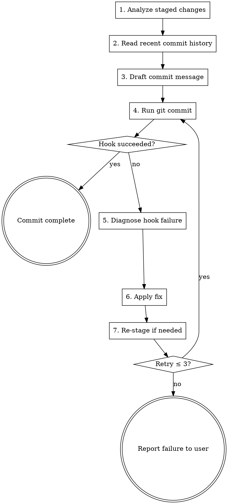

# Git Commit

## Overview

Create well-structured git commits following the [Conventional Commits](https://www.conventionalcommits.org/) specification, with an automated retry loop that handles hook failures until the commit lands locally.

## When to Use

- User asks to commit, create a commit, or save changes
- After completing a feature, fix, or refactor
- When staged changes are ready to be committed

## When NOT to Use

- Amending or rebasing existing commits (different workflow)
- Interactive rebase operations
- Cherry-picking

## Commit Message Format

```
<type>(<scope>): [<TASK_ID>] <subject>

<body>

<footer>
```

`[<TASK_ID>]` is included only when a task/ticket ID is known; otherwise omit it.

### Types

| Type | Purpose |
|------|---------|
| `feat` | New feature |
| `fix` | Bug fix |
| `docs` | Documentation only |
| `style` | Formatting, semicolons, etc. (no logic change) |
| `refactor` | Code restructuring (no feature/fix) |
| `perf` | Performance improvement |
| `test` | Adding or updating tests |
| `build` | Build system or dependencies |
| `ci` | CI/CD configuration |
| `chore` | Maintenance tasks |
| `revert` | Reverting a previous commit |

### Rules

- **subject**: imperative mood, lowercase, no period, max 72 chars
- **scope**: optional, identifies the module/area affected
- **task ID**: if a task/ticket ID is known (e.g. Jira, Linear), prepend `[{TASK_ID}]` to the subject line
- **body**: explain *why*, not *what* (the diff shows what)
- **footer**: `BREAKING CHANGE:` for breaking changes, or issue refs like `Closes #123`
- Breaking changes can also be indicated by appending `!` after the type/scope: `feat!: remove legacy API`

### Examples

```
feat(auth): [PROJ-442] add JWT token refresh on expiry

Tokens now auto-refresh 5 minutes before expiration to prevent
users from being silently logged out during active sessions.
```

```
fix(parser): [PROJ-518] handle empty input without throwing

Previously, passing an empty string caused an unhandled TypeError.
Now returns an empty result set consistent with other edge cases.
```

```
chore: upgrade eslint to v9 and migrate config

BREAKING CHANGE: flat config format required — .eslintrc no longer supported
```

The third example has no task ID — this is valid when no ticket is associated.

## Workflow



### Step 1: Analyze Staged Changes

Run these in parallel:

```bash
git diff --cached --stat
git diff --cached
git status --short
```

If nothing is staged, stop and tell the user. Do NOT auto-stage all changes — ask the user what to stage.

### Step 2: Read Recent Commit History

```bash
git log --oneline -10
```

Check if the project follows a specific commit style variant (e.g. scopes, emoji prefixes). Adapt to the existing style when possible while staying within Conventional Commits.

### Step 3: Draft Commit Message

1. Identify the primary change type from the diff
2. Determine scope from the files/modules touched
3. Check if a task/ticket ID is known (from user context, branch name like `feature/PROJ-123-desc`, or conversation). If yes, include `[TASK_ID]` in the subject
4. Write the subject line in imperative mood
5. Add body only if the *why* is not obvious from the subject
6. Add footer for breaking changes or issue references

Pass the message via HEREDOC to preserve formatting:

```bash
git commit -m "$(cat <<'EOF'
<type>(<scope>): <subject>

<body>

<footer>
EOF
)"
```

### Step 4: Execute the Commit

Run `git commit` and capture the full output (stdout + stderr).

### Step 5: Handle Hook Failures

If the commit fails (non-zero exit), determine the hook type and apply the appropriate strategy:

#### Pre-commit Hook Failures

Common causes and fixes:

| Cause | Fix |
|-------|-----|
| Lint errors | Run the project's linter with `--fix`, then re-stage |
| Format violations | Run the project's formatter, then re-stage |
| Type errors | Fix the type issues in source code, then re-stage |
| Test failures | Fix the failing tests, then re-stage |
| Trailing whitespace | Auto-fixable — re-stage after hook auto-fixes |
| Large file blocked | Remove or use git-lfs, then re-stage |

**Key**: If the hook auto-fixed files (e.g. prettier, eslint --fix), just re-stage the modified files and retry — do NOT create a new commit.

```bash
git add -u
git commit -m "$(cat <<'EOF'
<same message>
EOF
)"
```

#### Commit-msg Hook Failures

The hook rejected the message format. Common validators:

- **commitlint**: Check `.commitlintrc.*` or `commitlint.config.*` for the rules
- **custom regex**: Read the hook script at `.git/hooks/commit-msg` or the configured hooksPath

Fix: Rewrite the commit message to match the project's expected format, then retry.

#### Prepare-commit-msg Hook Failures

Rare. Usually means a template injection script failed. Read the hook script to understand the expected behavior, fix the underlying issue, and retry.

### Step 6: Retry Loop

- Maximum **3 retries** after the initial attempt
- Each retry must address a **different** issue — if the same error repeats, stop and report
- After each fix, always re-stage changed files before retrying
- If retries are exhausted, report the final error output to the user with a clear explanation of what went wrong and what was attempted

## Hook Discovery

To understand the project's hooks before committing:

```bash
# Check configured hooks path
git config core.hooksPath

# List active hooks
ls -la "$(git config core.hooksPath 2>/dev/null || echo .git/hooks)"

# Common hook managers to look for
# - .husky/         (Husky)
# - .lefthook.yml   (Lefthook)
# - .pre-commit-config.yaml (pre-commit framework)
# - package.json → "lint-staged" (lint-staged)
```

## Common Mistakes

| Mistake | Correction |
|---------|------------|
| Auto-staging all changes without asking | Only commit what the user explicitly staged; ask before staging |
| Using `--no-verify` to bypass hooks | Never skip hooks unless the user explicitly requests it |
| Retrying with the same failing message | Each retry must address the specific error from the previous attempt |
| Writing "what" instead of "why" in body | The diff shows what changed; the body explains the motivation |
| Overly long subject line | Keep ≤ 72 chars; move details to body |
| Using `--amend` without checking safety | Only amend if HEAD was created in this session AND not yet pushed |
